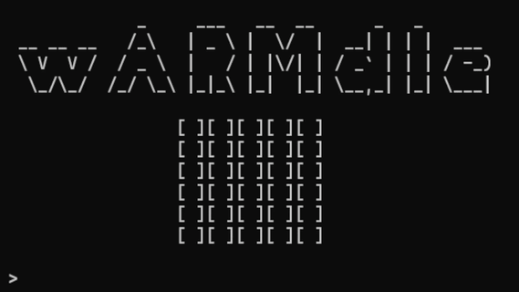

# wARMdle

A [Wordle](https://www.nytimes.com/games/wordle/index.html) clone for Linux written in 32-bit ARM assembly.

## Building

Just give it the ol' `./configure && make`. If you're cross-compiling, use the `--host=arm-linux-gnueabihf` option when running `./configure`. This should produce a `warmdle` binary in your working directory. 

## Why?

I wrote this as a little exercise after finishing [Azeria Labs' ARM Assembly Tutorial](https://azeria-labs.com/writing-arm-assembly-part-1/). It was also a project to learn the GNU Autotools build system.
